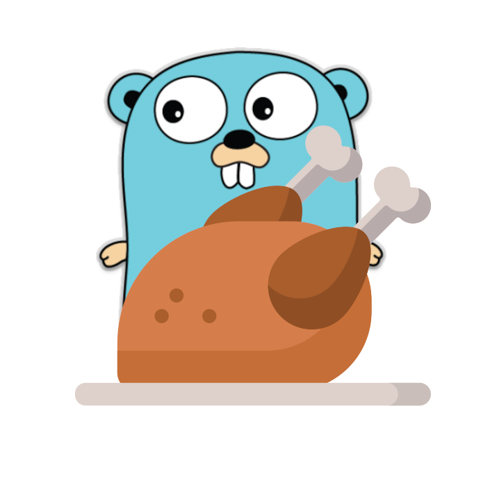

  

<h1 align="center">Broilerplate</h1>

<h3 align="center">A template project for new Go web backend applications.</h3>

Can be used as a starting point for quickly prototyping a REST API or fully-fledged server-rendered web application in Go, backend by a relational database and common authentication / authorization. Originating from my work on [Wakapi](https://github.com/muety/wakapi).

## 🚀 Features
* **Data management**
  * Easy-to-use ORM to map between Go struct and databases entities
  * Multiple databases supported, including MySQL, Postgres and SQLite
  * Simple schema migrations (+ automatic schema generation)
* **Authentication**
  * Cookie-based authentication (using [gorilla/securecookie](https://godoc.org/github.com/gorilla/securecookie))
  * API key authentication (via header or query param)
* **Configuration**
  * YAML configuration
  * Environment variables
* **Mailing**
  * HTML templates
  * SMTP integration
  * [MailWhale](https://mailwhale.dev) integration
* **User Interface**
  * Plain Go HTML templates
  * CSS styling with [TailwindCSS](https://tailwindcss.com/)
  * Icons with [Iconify](https://iconify.design/)
* **[Sentry](https://sentry.io) integration**
* **[Prometheus](https://prometheus.io) metrics exports**
* **[Swagger](https://swagger.io) API docs**
* **Unit Testing**
* **API Testing** (with [newman](https://www.npmjs.com/package/newman))
* **Docker support**

### Currently not included
* Advanced authorization mechanisms / RBAC
* Multi-tenancy

## 🧂 Ingredients
* Web server: [net/http](https://godoc.org/net/http) (stdlib)
* Routing: [gorilla/mux](https://godoc.org/github.com/gorilla/mux)
* Database / ORM: [gorm.io/gorm](https://godoc.org/gorm.io/gorm)
* Templating: [html/template](https://godoc.org/html/template) (stdlib)
* Configuration: [jinzhu/configor](https://godoc.org/github.com/jinzhu/configor)
* Logging: [emvi/logbuch](https://godoc.org/github.com/emvi/logbuch)
* Event bus: [leandro-lugaresi/hub](https://godoc.org/github.com/leandro-lugaresi/hub)
* Caching: [patrickmn/go-cache](https://godoc.org/github.com/patrickmn/go-cache)

## 📓 License
MIT