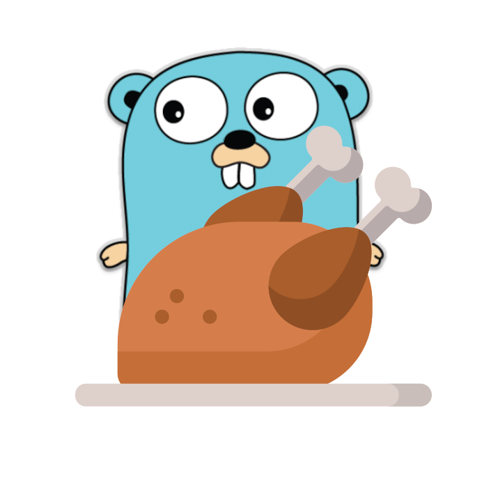

<p align="center">
  
</p>

<h1 align="center">Broilerplate</h1>

<h3 align="center">A template project for new Go web backend applications.</h3>

Can be used as a starting point for quickly prototyping a REST API or fully-fledged server-rendered web application in Go, backend by a relational database and common authentication / authorization. Originating from my work on [wakapi](https://github.com/muety/wakapi).

## 🚀 Features
* **Data management**
  * Easy-to-use ORM to map between Go struct and databases entities
  * Multiple databases supported, including MySQL, Postgres and SQLite
  * Simple schema migrations (+ automatic schema generation)
* **Authentication**
  * Cookie-based authentication (using [gorilla/securecookie](https://godoc.org/github.com/gorilla/securecookie))
  * API key authentication (via header or query param)
* **Configuration**
  * YAML configuration
  * Environment variables
* **Mailing**
  * HTML templates
  * SMTP integration
  * [MailWhale](https://mailwhale.dev) integration
* **User Interface**
  * Plain Go HTML templates
  * CSS styling with [TailwindCSS](https://tailwindcss.com/)
  * Icons with [Iconify](https://iconify.design/)
  * Simple data binding with [petite-vue](https://github.com/vuejs/petite-vue)
  * Pre-compressed assets using Brotli (see [wakapi#284](https://github.com/muety/wakapi/issues/284))
* **[Prometheus](https://prometheus.io) metrics exports**
* **[Swagger](https://swagger.io) API docs**
* **Unit Testing**
* **Docker support**

### Currently not included
* Multi-tenancy
* Advanced authorization mechanisms / RBAC
* API testing (see [wakapi/testing](https://github.com/muety/wakapi/tree/master/testing), though)

## 🧂 Ingredients
* Web server: [net/http](https://godoc.org/net/http) (stdlib)
* Routing: [gorilla/mux](https://godoc.org/github.com/gorilla/mux)
* Database / ORM: [gorm.io/gorm](https://godoc.org/gorm.io/gorm)
* Templating: [html/template](https://godoc.org/html/template) (stdlib)
* Configuration: [jinzhu/configor](https://godoc.org/github.com/jinzhu/configor)
* Logging: [emvi/logbuch](https://godoc.org/github.com/emvi/logbuch)
* Event bus: [leandro-lugaresi/hub](https://godoc.org/github.com/leandro-lugaresi/hub)
* Caching: [patrickmn/go-cache](https://godoc.org/github.com/patrickmn/go-cache)
* Styling: [tailwindlabs/tailwindcss](https://github.com/tailwindlabs/tailwindcss)
* Data binding: [vuejs/petite-vue](https://github.com/vuejs/petite-vue)

## 🏃‍♀️ Run
### Prerequisites
* Go >= 1.16
* Node.js >= 14 LTS
* gcc (to compile [go-sqlite3](https://github.com/mattn/go-sqlite3))
  * Fedora / RHEL: `dnf install @development-tools`
  * Ubuntu / Debian: `apt install build-essential`
  * Windows: See [here](https://github.com/mattn/go-sqlite3/issues/214#issuecomment-253216476)

### Compile & Run
```bash
# Fetch node modules
$ yarn

# Build web assets
$ yarn build:all:compress

# Build the executable
$ go build -o broilerplate

# Adapt config to your needs
$ cp config.default.yml config.yml
$ vi config.yml

# Run it
$ ./broilerplate
```

## 🔧 Configuration Options
You can specify configuration options either via a config file (default: `config.yml`, customizable through the `-c` argument) or via environment variables. Here is an overview of all options.

| YAML Key / Env. Variable                                                     | Default                                          | Description                                                                                                                                                              |
|------------------------------------------------------------------------------|--------------------------------------------------|--------------------------------------------------------------------------------------------------------------------------------------------------------------------------|
| `env` /<br>`ENVIRONMENT`                                                     | `dev`                                            | Whether to use development- or production settings                                                                                                                       |
| `app.avatar_url_template`                                                    | (see [`config.default.yml`](config.default.yml)) | URL template for external user avatar images (e.g. from [Dicebear](https://dicebear.com) or [Gravatar](https://gravatar.com))                                            |
| `server.port` /<br> `BROILERPLATE_PORT`                                            | `3000`                                           | Port to listen on                                                                                                                                                        |
| `server.listen_ipv4` /<br> `BROILERPLATE_LISTEN_IPV4`                              | `127.0.0.1`                                      | IPv4 network address to listen on (leave blank to disable IPv4)                                                                                                          |
| `server.listen_ipv6` /<br> `BROILERPLATE_LISTEN_IPV6`                              | `::1`                                            | IPv6 network address to listen on (leave blank to disable IPv6)                                                                                                          |
| `server.listen_socket` /<br> `BROILERPLATE_LISTEN_SOCKET`                          | -                                                | UNIX socket to listen on (leave blank to disable UNIX socket)                                                                                                            |
| `server.timeout_sec` /<br> `BROILERPLATE_TIMEOUT_SEC`                              | `30`                                             | Request timeout in seconds                                                                                                                                               |
| `server.tls_cert_path` /<br> `BROILERPLATE_TLS_CERT_PATH`                          | -                                                | Path of SSL server certificate (leave blank to not use HTTPS)                                                                                                            |
| `server.tls_key_path` /<br> `BROILERPLATE_TLS_KEY_PATH`                            | -                                                | Path of SSL server private key (leave blank to not use HTTPS)                                                                                                            |
| `server.base_path` /<br> `BROILERPLATE_BASE_PATH`                                  | `/`                                              | Web base path (change when running behind a proxy under a sub-path)                                                                                                      |
| `security.password_salt` /<br> `BROILERPLATE_PASSWORD_SALT`                        | -                                                | Pepper to use for password hashing                                                                                                                                       |
| `security.insecure_cookies` /<br> `BROILERPLATE_INSECURE_COOKIES`                  | `false`                                          | Whether or not to allow cookies over HTTP                                                                                                                                |
| `security.cookie_max_age` /<br> `BROILERPLATE_COOKIE_MAX_AGE`                      | `172800`                                         | Lifetime of authentication cookies in seconds or `0` to use [Session](https://developer.mozilla.org/en-US/docs/Web/HTTP/Cookies#Define_the_lifetime_of_a_cookie) cookies |
| `security.allow_signup` /<br> `BROILERPLATE_ALLOW_SIGNUP`                          | `true`                                           | Whether to enable user registration                                                                                                                                      |
| `security.expose_metrics` /<br> `BROILERPLATE_EXPOSE_METRICS`                      | `false`                                          | Whether to expose Prometheus metrics under `/api/metrics`                                                                                                                |
| `db.host` /<br> `BROILERPLATE_DB_HOST`                                             | -                                                | Database host                                                                                                                                                            |
| `db.port` /<br> `BROILERPLATE_DB_PORT`                                             | -                                                | Database port                                                                                                                                                            |
| `db.user` /<br> `BROILERPLATE_DB_USER`                                             | -                                                | Database user                                                                                                                                                            |
| `db.password` /<br> `BROILERPLATE_DB_PASSWORD`                                     | -                                                | Database password                                                                                                                                                        |
| `db.name` /<br> `BROILERPLATE_DB_NAME`                                             | `BROILERPLATE_db.db`                             | Database name                                                                                                                                                            |
| `db.dialect` /<br> `BROILERPLATE_DB_TYPE`                                          | `sqlite3`                                        | Database type (one of `sqlite3`, `mysql`, `postgres`, `cockroach`)                                                                                                       |
| `db.charset` /<br> `BROILERPLATE_DB_CHARSET`                                       | `utf8mb4`                                        | Database connection charset (for MySQL only)                                                                                                                             |
| `db.max_conn` /<br> `BROILERPLATE_DB_MAX_CONNECTIONS`                              | `2`                                              | Maximum number of database connections                                                                                                                                   |
| `db.ssl` /<br> `BROILERPLATE_DB_SSL`                                               | `false`                                          | Whether to use TLS encryption for database connection (Postgres and CockroachDB only)                                                                                    |
| `db.automgirate_fail_silently` /<br> `BROILERPLATE_DB_AUTOMIGRATE_FAIL_SILENTLY`   | `false`                                          | Whether to ignore schema auto-migration failures when starting up                                                                                                        |
| `mail.enabled` /<br> `BROILERPLATE_MAIL_ENABLED`                                   | `true`                                           | Whether to allow BROILERPLATE to send e-mail (e.g. for password resets)                                                                                                        |
| `mail.sender` /<br> `BROILERPLATE_MAIL_SENDER`                                     | `noreply@exampl.org`                             | Default sender address for outgoing mails (ignored for MailWhale)                                                                                                        |
| `mail.provider` /<br> `BROILERPLATE_MAIL_PROVIDER`                                 | `smtp`                                           | Implementation to use for sending mails (one of [`smtp`, `mailwhale`])                                                                                                   |
| `mail.smtp.*` /<br> `BROILERPLATE_MAIL_SMTP_*`                                     | `-`                                              | Various options to configure SMTP. See [default config](config.default.yml) for details                                                                                  |
| `mail.mailwhale.*` /<br> `BROILERPLATE_MAIL_MAILWHALE_*`                           | `-`                                              | Various options to configure [MailWhale](https://mailwhale.dev) sending service. See [default config](config.default.yml) for details                                    |

## 👏 Support
Coding in open source is my passion and I would love to do it on a full-time basis and make a living from it one day. So if you like this project, please consider supporting it 🙂. You can donate either through [buying me a coffee](https://buymeacoff.ee/n1try) or becoming a GitHub sponsor. Every little donation is highly appreciated and boosts my motivation to keep improving!

## 📓 License
MIT